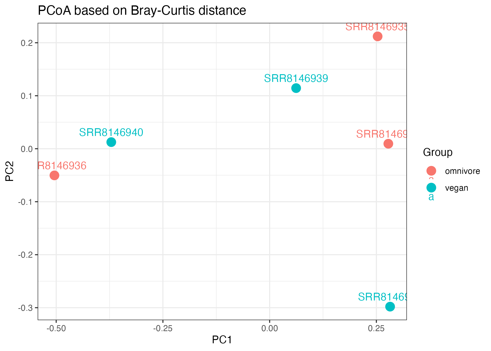

## **Introduction**

The human gut microbiome is a complex community of microorganisms that is critical to host metabolism, immune regulation, and overall health. Increasing evidence suggests that diet is one of the most influential factors shaping microbial composition and diversity. In particular, plant-based diets have been associated with increased microbial diversity and enrichment of taxa involved in fiber fermentation, while omnivorous diets may favor different metabolic profiles (David et al., 2014). 

Several sequencing approaches have been used to study microbial communities, mostly 16S rRNA gene sequencing and shotgun metagenomic sequencing. 16S rRNA sequencing is limited in taxonomic resolution and cannot distinguish closely related species or provide functional insights (Callahan et al., 2017). In contrast, shotgun metagenomic sequencing enables comprehensive analysis of all genetic material in a sample, allowing for higher-resolution taxonomic classification and the potential to infer functional capabilities of microbial communities (Quince et al., 2017). 

Within shotgun metagenomic workflows, K-mer–based classifiers such as Kraken2 enable rapid assignment of sequencing reads by matching short DNA sequences to reference databases (Wood et al., 2019), while downstream Bracken refine abundance estimates by redistributing reads assigned to higher taxonomic levels (Lu et al., 2017). Compared to alignment-based approaches, k-mer–based methods are computationally efficient but may be influenced by database completeness and parameter choices. Additionally, the use of reduced reference databases, such as mini Kraken2 databases, improves computational efficiency but may reduce classification accuracy and taxonomic resolution.

By analyzing microbial composition at the genus level using shotgun metagenomic data, it is possible to investigate how dietary patterns influence microbiome structure while considering the methodological trade-offs inherent in different analytical approaches.

The objective of this study was to compare gut microbiome composition between omnivore and vegan individuals using shotgun metagenomic data. Specifically, this study aimed to examine taxonomic composition, assess alpha diversity, evaluate beta diversity, and identify differentially abundant taxa between dietary groups.

## **Methods**

**Data and Preprocessing**

Six shotgun metagenomic samples were analyzed in this study, consisting of three omnivore samples (SRR8146935, SRR8146936, SRR8146938) and three vegan samples (SRR8146937, SRR8146939, SRR8146940). The raw data were downloaded in SRA format and converted to FASTQ files using the SRA Toolkit.

Quality control was performed using FastQC (version 0.11.x). FastQC was used to assess sequence quality scores, GC content, sequence length distribution, and the presence of adapter contamination. The QC results indicated that the sequencing data were of acceptable quality for downstream analysis, and no additional trimming or filtering steps were applied.

**Taxonomic Classification and Abundance Estimation**

Taxonomic classification was performed using Kraken2 (version 2.x), a k-mer–based classifier that assigns sequencing reads to taxa by exact matching of k-mers to a reference database (Wood et al., 2019). In this analysis, a mini Kraken2 database(8gb) was used rather than the full standard database(50gb-100gb). This reduced database decreases memory usage but may also reduce classification sensitivity and taxonomic resolution.

Default Kraken2 parameters were used for classification, including the default confidence threshold. Reads were classified at multiple taxonomic levels, and genus-level assignments were extracted for downstream analysis.

Following classification, abundance estimation was refined using Bracken (version 2.x), which applies a Bayesian approach to redistribute reads assigned to higher taxonomic levels (Lu et al., 2017). Bracken was run at the genus level, and the output files (.bracken.genus) provided both estimated read counts and relative abundance values.

The parameter settings for Bracken included:
Taxonomic level: genus
Read length: matched to sequencing data (default setting)
Database: corresponding mini Kraken2 database

**Construction of Abundance Table**

Genus abundance data from all six samples were merged into a single abundance table using R. Missing values were replaced with zeros to ensure consistent representation of taxa across samples. The resulting matrix contained samples as rows and genera as columns, with values representing relative abundance.

**Alpha Diversity Analysis**

Alpha diversity was calculated using the vegan R package (Oksanen et al., 2022). The following diversity indices were computed: Shannon diversity index, Simpson diversity index and Observed richness. These metrics were calculated based on the genus abundance data and compared between omnivore and vegan groups.

## **Result**
**Taxonomic Composition**

Figure 1. 

Figure-1 is the relative abundance of the top 10 bacterial genera across omnivore and vegan samples. Each bar represents an individual sample, and colors indicate different genera. The result revealed variation across samples, with some dominant taxa contributing to the microbial community. Alistipes showed relatively high abundance across all samples, with values from 0.035 in SRR8146936 to 0.249 in SRR8146935.

Differences between dietary groups were observed. Bacteroides showed higher abundance in some omnivore samples (0.209 in SRR8146938) compared to vegan samples (0.0487 in SRR8146940). Similarly, Phocaeicola showed higher mean abundance in omnivore samples (0.0633) compared to vegan samples (0.0254). In contrast, some genera such as Parabacteroides appeared consistent across groups, suggesting both shared core microbiota and diet-associated variation.

Overall, omnivore samples showed stronger dominance by specific taxa, while vegan samples displayed more evenly distributed genus-level abundances.

**Alpha Diversity**

Figure-2

Figure 2. Shannon diversity index comparison between omnivore and vegan groups. Points represent individual samples, and boxplots summarize group distributions.

Alpha diversity analysis demonstrated that vegan samples exhibited higher Shannon diversity compared to omnivore samples. Specifically, Shannon diversity values for vegan samples were 2.88, 2.91, and approximately 2.90, whereas omnivore samples showed greater variability, with values of 1.45, 2.28, and 2.80.

The lowest diversity was observed in omnivore sample SRR8146936 (Shannon = 1.45), indicating a less diverse and more uneven microbial community. In contrast, vegan samples consistently showed high diversity (all > 2.8), suggesting a more complex and evenly distributed microbiome.

Similarly, Simpson diversity values supported this trend, with vegan samples exhibiting high values (0.90–0.92), compared to more variable values in omnivores (0.56–0.87). Observed richness also varied widely, with one omnivore sample showing particularly high richness (838 genera), indicating substantial intra-group variability.

Overall, these results suggest that vegan diets are associated with more consistent and higher microbial diversity, although variability within omnivore samples highlights individual differences.

**Beta Diversity**

Figure-3

Figure 3. Principal Coordinates Analysis (PCoA) based on Bray–Curtis dissimilarity showing differences in microbial community composition between samples.

Beta diversity analysis using Bray–Curtis dissimilarity revealed partial separation between omnivore and vegan samples. Vegan samples showed a tendency to cluster more closely together in ordination space, indicating greater similarity in microbial composition within this group.

In contrast, omnivore samples were more widely dispersed, suggesting higher variability in microbial communities among individuals consuming omnivorous diets. This pattern is consistent with the alpha diversity results, which showed greater variability among omnivore samples.

Despite this trend, overlap between the two dietary groups was observed, indicating that diet is not the sole determinant of microbiome composition. PERMANOVA analysis did not detect statistically significant differences between groups, likely due to the small sample size (n = 3 per group) and within-group variability.

**Differential Abundance**

Figure-4

Figure 4. Differential abundance analysis of bacterial genera between vegan and omnivore groups. Each point represents a genus, with log2 fold change indicating differences in relative abundance.

Differential abundance analysis did not identify any genera that were statistically significant after multiple testing correction (all FDR ≈ 0.87). This indicates that no taxa showed strong evidence of differential abundance between dietary groups under the current sample size and variability.

However, several genera exhibited notable trends. For example, Phocaeicola showed higher mean abundance in omnivore samples (0.0633) compared to vegan samples (0.0254), corresponding to a negative log2 fold change (-1.32), indicating enrichment in omnivores. Similarly, Prevotella and Barnesiella also showed reduced abundance in vegan samples.

Conversely, some genera showed relatively smaller differences between groups, suggesting a shared microbial core across diets. The absence of statistically significant results is likely due to the limited sample size and variability in relative abundance, which reduces statistical power to detect subtle differences.

