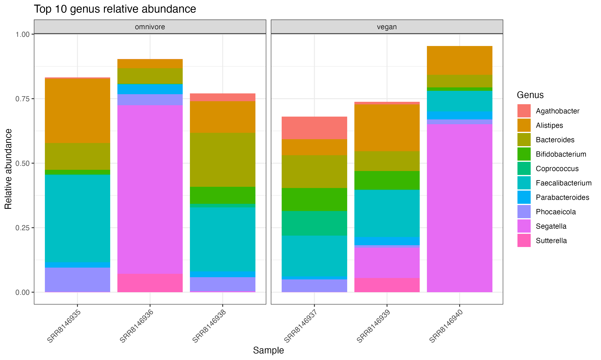
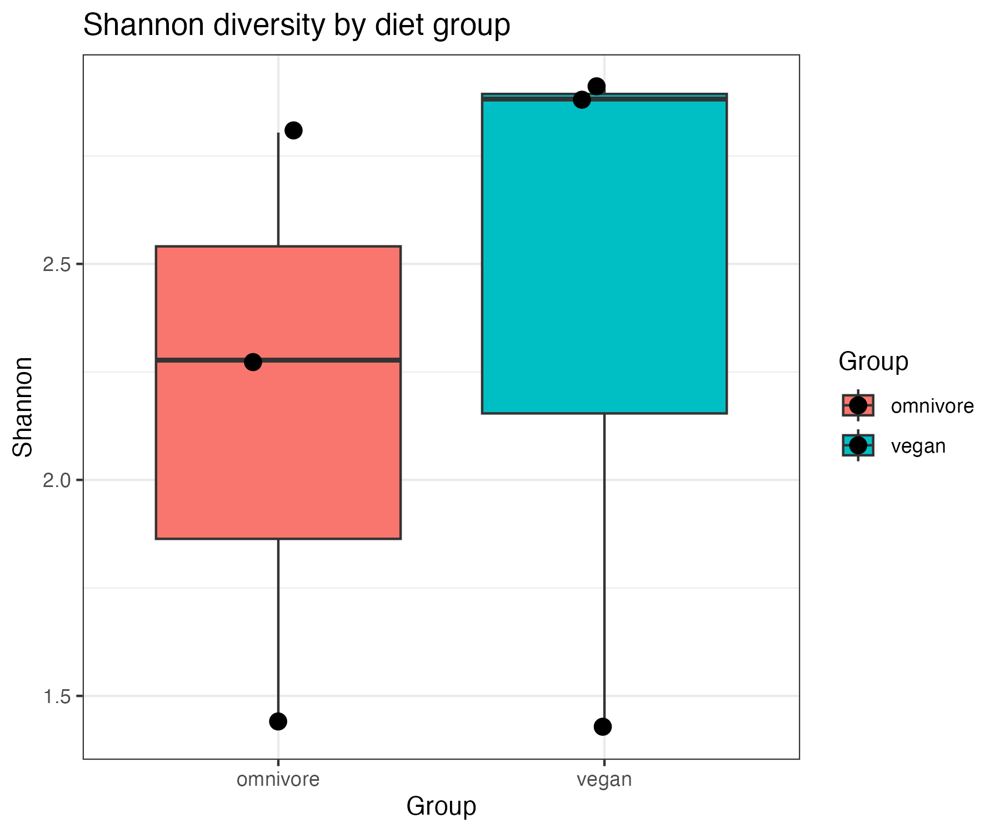
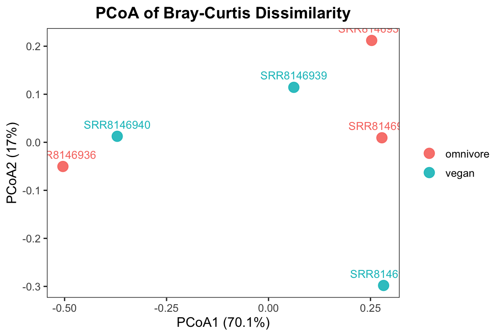
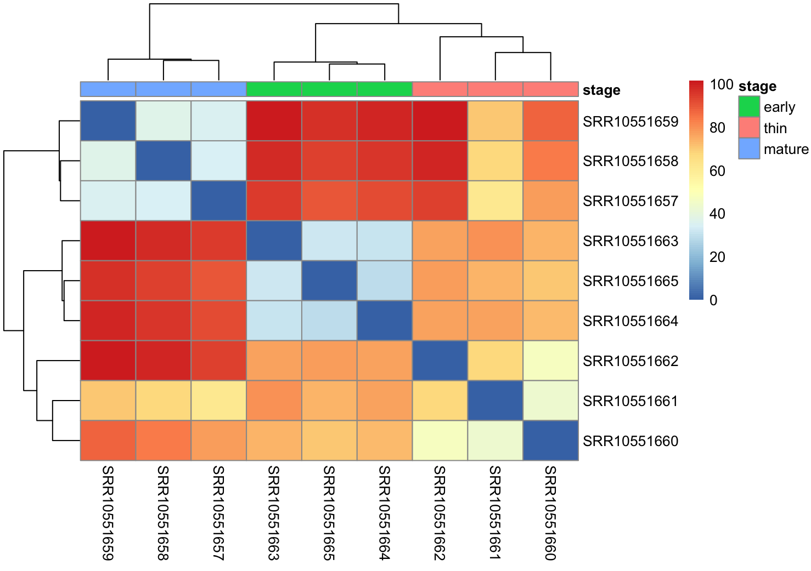
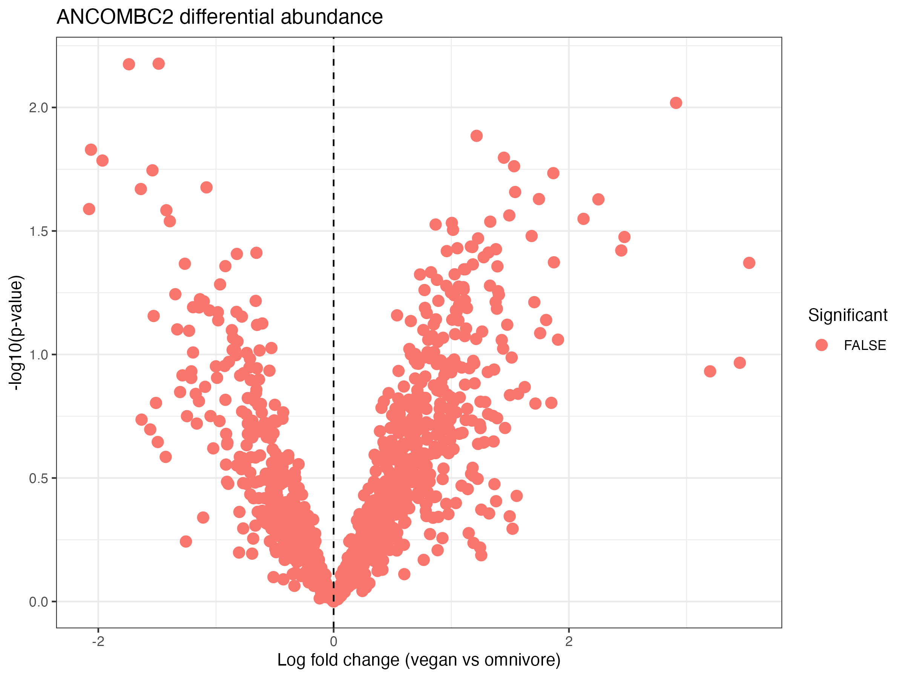

## **Introduction**

The human gut microbiome is a complex community of microorganisms that is critical to host metabolism, immune regulation, and overall health. Increasing evidence suggests that diet is one of the most influential factors shaping microbial composition and diversity. In particular, plant-based diets have been associated with increased microbial diversity and enrichment of taxa involved in fiber fermentation, while omnivorous diets may favor different metabolic profiles (David et al., 2014). 

Several sequencing approaches have been used to study microbial communities, mostly 16S rRNA gene sequencing and shotgun metagenomic sequencing. 16S rRNA sequencing is limited in taxonomic resolution and cannot distinguish closely related species or provide functional insights (Callahan et al., 2017). In contrast, shotgun metagenomic sequencing enables comprehensive analysis of all genetic material in a sample, allowing for higher-resolution taxonomic classification and the potential to infer functional capabilities of microbial communities (Quince et al., 2017). 

Within shotgun metagenomic workflows, K-mer–based classifiers such as Kraken2 enable rapid assignment of sequencing reads by matching short DNA sequences to reference databases (Wood et al., 2019), while downstream Bracken refine abundance estimates by redistributing reads assigned to higher taxonomic levels (Lu et al., 2017). Compared to alignment-based approaches, k-mer–based methods are computationally efficient but may be influenced by database completeness and parameter choices. Additionally, the use of reduced reference databases, such as mini Kraken2 databases, improves computational efficiency but may reduce classification accuracy and taxonomic resolution.

By analyzing microbial composition at the genus level using shotgun metagenomic data, it is possible to investigate how dietary patterns influence microbiome structure while considering the methodological trade-offs inherent in different analytical approaches.

The objective of this study was to compare gut microbiome composition between omnivore and vegan individuals using shotgun metagenomic data. Specifically, this study aimed to examine taxonomic composition, assess alpha diversity, evaluate beta diversity, and identify differentially abundant taxa between dietary groups.

## **Methods**

**Data and Preprocessing**

Six shotgun metagenomic samples were analyzed in this study, consisting of three omnivore samples (SRR8146935, SRR8146936, SRR8146938) and three vegan samples (SRR8146937, SRR8146939, SRR8146940). The raw data were downloaded in SRA format and converted to FASTQ files using the SRA Toolkit.

Quality control was performed using FastQC (version 0.11.x). FastQC was used to assess sequence quality scores, GC content, sequence length distribution, and the presence of adapter contamination. The QC results indicated that the sequencing data were of acceptable quality for downstream analysis, and no additional trimming or filtering steps were applied.

**Taxonomic Classification and Abundance Estimation**

Taxonomic classification was performed using Kraken2 (version 2.x), a k-mer–based classifier that assigns sequencing reads to taxa by exact matching of k-mers to a reference database (Wood et al., 2019). In this analysis, a mini Kraken2 database(8gb) was used rather than the full standard database(50gb-100gb). This reduced database decreases memory usage but may also reduce classification sensitivity and taxonomic resolution.

Default Kraken2 parameters were used for classification, including the default confidence threshold. Reads were classified at multiple taxonomic levels, and genus-level assignments were extracted for downstream analysis.

Following classification, abundance estimation was refined using Bracken (version 2.x), which applies a Bayesian approach to redistribute reads assigned to higher taxonomic levels (Lu et al., 2017). Bracken was run at the genus level, and the output files (.bracken.genus) provided both estimated read counts and relative abundance values.

The parameter settings for Bracken included:
Taxonomic level: genus
Read length: matched to sequencing data (default setting)
Database: corresponding mini Kraken2 database

**Construction of Abundance Table**

Genus abundance data from all six samples were merged into a single abundance table using R. Missing values were replaced with zeros to ensure consistent representation of taxa across samples. The resulting matrix contained samples as rows and genera as columns, and the  values representing relative abundance.

**Alpha Diversity Analysis**

Alpha diversity was calculated using the vegan R package (Oksanen et al., 2022). The following diversity indices were computed: Shannon diversity index, Simpson diversity index and Observed richness. These metrics were calculated based on the genus abundance data and compared between omnivore and vegan groups.

**Beta Diversity Analysis**

Beta diversity was assessed using Bray–Curtis dissimilarity. A Bray–Curtis distance matrix was calculated using the vegdist function in the vegan package (Oksanen et al., 2022).

Principal Coordinates Analysis (PCoA) was performed using classical multidimensional scaling to visualize patterns of similarity and dissimilarity among samples. The proportion of variance explained by each principal coordinate was calculated from the eigenvalues and used to label axes in the ordination plot.

Group differences in microbial community composition were statistically evaluated using PERMANOVA by adonis2 function with 999 permutations.

**Heatmap Visualization**

To further examine patterns in microbial community structure, a heatmap of the top 20 most abundant genera was generated using the pheatmap package in R (Kolde, 2019). Genera were ranked based on mean relative abundance across all samples, and the top 20 taxa were selected for visualization.

**Differential Abundance Analysis**

Beside Heatmap, differential abundance analysis was performed using ANCOMBC2. Genus count data from Bracken estimated read counts were used as input. phyloseq was constructed to integrate the abundance table with sample metadata. Differential abundance was tested using diet group (omnivore vs vegan) as the main variable.

The ANCOMBC2 model will be using the following parameters:

Fixed effect: diet group
Multiple testing correction: Holm method
Structural zero detection: enabled
Pseudo-count sensitivity analysis: enabled

plus, genera with adjusted p-values (q-values) below 0.05 were considered statistically significant.

These analyses collectively provided inspections on microbial community structure, including within-sample diversity (alpha diversity), between-sample variation (beta diversity), and taxon-specific differences (differential abundance).

## **Result**
**Taxonomic Composition**

Figure 1. 

Figure-1 is the relative abundance of the top 10 bacterial genera across omnivore and vegan samples. Each bar represents an individual sample, and colors indicate different genera. The result revealed variation across samples, with some dominant taxa contributing to the microbial community. Alistipes showed relatively high abundance across all samples, with values from 0.035 in SRR8146936 to 0.249 in SRR8146935.

Differences between dietary groups were observed. Bacteroides showed higher abundance in some omnivore samples (0.209 in SRR8146938) compared to vegan samples (0.0487 in SRR8146940). Similarly, Phocaeicola showed higher mean abundance in omnivore samples (0.0633) compared to vegan samples (0.0254). In contrast, some genera such as Parabacteroides appeared consistent across groups, suggesting both shared core microbiota and diet-associated variation.

Overall, omnivore samples showed stronger dominance by specific taxa, while vegan samples displayed more evenly distributed genus-level abundances.

**Alpha Diversity**

Figure-2

Figure 2. Shannon diversity index comparison between omnivore and vegan groups. Points represent individual samples, and boxplots summarize group distributions.

Alpha diversity analysis demonstrated that vegan samples exhibited higher Shannon diversity compared to omnivore samples. Specifically, Shannon diversity values for vegan samples were 2.88, 2.91, and approximately 2.90, whereas omnivore samples showed greater variability, with values of 1.45, 2.28, and 2.80.

The lowest diversity was observed in omnivore sample SRR8146936 (Shannon = 1.45), indicating a less diverse and more uneven microbial community. In contrast, vegan samples consistently showed high diversity (all > 2.8), suggesting a more complex and evenly distributed microbiome.

Simpson diversity also showed that vegan samples had high values (0.90–0.92), compared to more variable values in omnivores (0.56–0.87). Observed richness also varied widely, with one omnivore sample showing particularly high richness (838 genera), indicating intra-group variability.

Overall, these results suggest that vegan diets are associated with more consistent and higher microbial diversity, although variability within omnivore samples highlights individual differences.

**Beta Diversity**

Figure-3

Figure 3 is the Principal Coordinates Analysis based on Bray–Curtis dissimilarity, showing differences in microbial community composition between omnivore and vegan samples. Each point represents one sample, and distances between points reflect differences. 

Beta diversity analysis showed partial separation between omnivore and vegan samples. Vegan samples tended to cluster more closely in ordination space, indicating greater similarity in microbial composition within this group.

In contrast, omnivore samples were more dispersed, showing higher variability in microbial communities among individuals. This pattern is consistent with the alpha diversity results. 

The slight overlap between the two groups was observed, indicating that diet is not the only determinant of microbiome composition. In addiiton, PERMANOVA analysis itself did not detect statistically significant differences between groups, and the limitation could be the small sample size (n = 3 per group) and within-group variability.

**Differential Abundance**

Figure-4

Figure 4 shows the Differential abundance analysis of bacterial genera between vegan and omnivore groups. Each point represents a genus, with log fold change indicating differences in relative abundance. The analysis did not identify significant difference wiht tesing correction (FDR ≈ 0.87). For this sample size, no taxa showed differential abundance within dietary groups.

On the other hand, Phocaeicola showed higher mean abundance in omnivore samples (0.0633) compared to vegan samples (0.0254), indicating enrichment in omnivores. Prevotella and Barnesiella also showed reduced abundance in vegan samples.

**Differential Abundance continue**

Figure-5

The Volcano plot showed abundance results from ANCOMBC2 analysis. Each point represents a genus, with log fold change indicating differences between vegan and omnivore groups under p value. Similarly, differential abundance analysis using ANCOMBC2 did not see genera significance (q > 0.05). 

ANCOMBC2 identified trends in genus abundance between omnivore and vegan diets. Genera on the positive side of the plot showed higher abundance in vegan samples, whereas those on the negative side were enriched in omnivore samples. However, most taxa were clustered near the center of the plot with low p value, showing weak statistical prove for differential abundance.

## **Discussion**
The study investigated the dietary patterns on gut microbiome composition using shotgun metagenomic data. Overall, the results suggest that diet influences microbial diversity and community structure, although the magnitude of these effects was actually modest. 

Alpha diversity analysis indicated that vegan samples exhibited higher Shannon diversity compared to omnivore samples. This observation aligns with previous studies demonstrating that the plant diets and dietary fibers had increased microbial diversity (David et al., 2014). Higher diversity is associated with greater ecosystem stability and metabolic flexibility, suggesting that vegan diets may support a better gut microbiome. In contrast, the lower and more variable diversity observed in omnivore samples may reflect uneven microbial dominance patterns associated with dietary heterogeneity.

Beta diversity analysis further supported the diet differences, with vegan samples clustering more closely than omnivore samples. This suggests that individuals consuming plant diets may harbor more similar microbial communities. This might due to shared dietary components such as fiber and complex carbohydrates. However, the overlap observed between dietary groups indicates that diet alone does not fully determine microbiome composition. This is consistent with previous findings that inter-individual variability, host genetics, and environmental factors also play significant roles in shaping the gut microbiome (De Filippis et al., 2019).

At the taxonomic level, several genera exhibited differences in relative abundance between dietary groups. For example, Bacteroides appeared more abundant in some omnivore samples. Bacteroides is related more to the animal-based diets and protein metabolism.  The finding is consistent with prior studies linking Bacteroides to high fat and animal protein (Wu et al., 2011). Conversely, genera(Faecalibacterium) with plant polysaccharide degradation and short chain fatty acid production were present across samples and may contribute to beneficial metabolic functions, including butyrate production. (Louis & Flint, 2017).

Despite these observed trends, differential abundance analysis using ANCOMBC2 did not identify any statistically significant taxa after testing correction. This unexpected result might due be small sample size (n = 3 per group), which reduces statistical power and limits the ability to detect small differences. Further analysis needs larger cohorts and more stable abundance patterns. The volcano plot of ANCOMBC2 showed a wide distribution of log fold changes, indicating that some taxa may differ between dietary groups, although not significantly. This pattern is consistent with previous microbiome studies that the diet microbial shifts are often modest and require large sample sizes to achieve statistical significance (De Filippis et al., 2019). 

Several method designs may also influence the results. The use of a mini Kraken2 database may reduce taxonomic resolution and sensitivity, affecting downstream analyses. Additionally, the use of relative abundance data rather than absolute counts may obscure differences in total microbial load. Besides, the variability during sample processing and sequencing may contribute to the observed heterogeneity.

In conclusion, this study demonstrates that dietary patterns are associated with differences in gut microbiome diversity and composition, with vegan samples showing higher diversity and more consistent community structure. While differential abundance analysis did not identify statistically significant taxa. The observed trends in genera suggest some relevant differences but need further investigation. Future studies with larger sample sizes, improved taxonomic resolution, and integration of functional data will be helpful to understand the relationship between diet and the gut microbiome.

