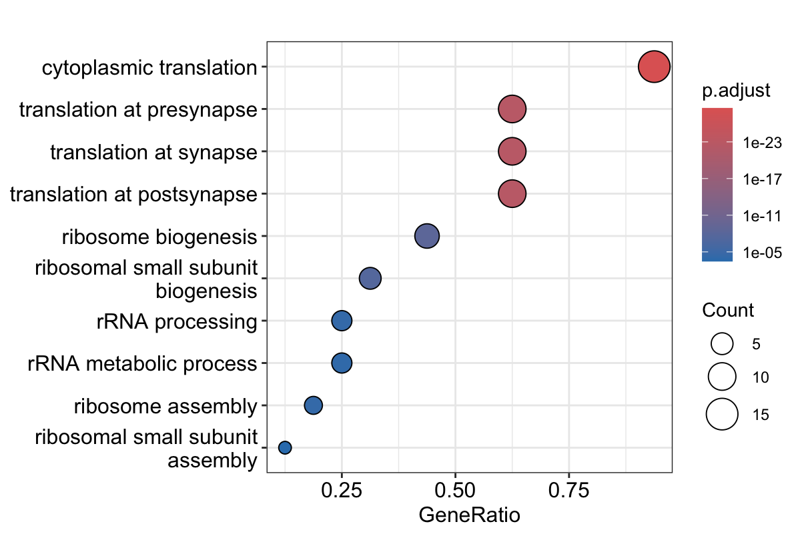

## **Introduction**

Influenza A virus (IAV) infection remains a major cause of respiratory disease and triggers complex immune responses in host tissues. Following infection, both epithelial and immune cell populations undergo dynamic changes in gene expression, which are critical for viral clearance and tissue recovery (Iwasaki & Pillai, 2014; Krammer et al., 2018). In particular, innate immune cells (macrophages) play a key role in recognizing viral components and initiating inflammatory signaling. On the other hand, epithelial cells contribute to both barrier function and antiviral responses. Understanding how these cell populations change over time is important for interpreting the progression of infection and host defense mechanisms.

Traditional bulk RNA sequencing approaches average gene expression across many cells, making it difficult to resolve cell type–specific responses. In contrast, single cell RNA sequencing (scRNA-seq) allows gene expression to be measured at the individual cell level, enabling identification of heterogeneous cell populations and their transcriptional states (Tang et al., 2009; Luecken & Theis, 2019). This approach is particularly useful in infection studies when different cell types can respond differently to the same stimulus.

Analysis of scRNA-seq data typically involves a series of computational steps, including quality control, normalization, dimensionality reduction, clustering, and marker gene identification. The Seurat framework provides an integrated pipeline for performing these steps, including graph-based clustering and visualization using dimensionality reduction techniques such as UMAP (Butler et al., 2018; Stuart et al., 2019). These methods enable identification of distinct cell populations and comparison of their transcriptional profiles across experimental conditions.

In this study, scRNA-seq data from mouse nasal tissues following IAV infection were analyzed to investigate changes in cell populations and gene expression over time. Clustering and marker gene analysis were used to identify major cell types, followed by differential expression analysis within a selected cluster to compare early and late time points. Functional enrichment analysis was then applied to interpret the biological processes associated with observed transcriptional changes.

## *Mathod

**Data source and preprocessing** 

A pre-processed Seurat object containing single-cell RNA sequencing (scRNA-seq) data and associated metadata was provided for analysis. The metadata included variables such as tissue type and time after infection, and those classifications were used in downstream comparisons. The object was imported into R and inspected to confirm the structure of the expression data and metadata before analysis began.

**Quality control and cell filtering**

Quality control was performed using three metrics: the number of detected genes per cell (nFeature_RNA), the total number of RNA counts per cell (nCount_RNA), and the proportion of mitochondrial transcripts (percent.mt). Mitochondrial percentage was calculated from genes matching the pattern "^mt-". Cells were retained only if they met all of the following criteria: more than 500 but fewer than 4000 detected genes, fewer than 10,000 total RNA counts, and less than 10% mitochondrial expression. Cells outside these thresholds were removed prior to downstream analysis.

Before filtering, several large internal slots in the Seurat object were cleared and garbage collection was run to reduce memory usage during processing. This step was used only for computational efficiency and did not change the analytical workflow.

**Normalization, feature selection, and dimensionality reduction**

The RNA assay was used for downstream analysis. Expression data were normalized using Seurat’s NormalizeData function with default settings. Highly variable genes were then identified using the variance-stabilizing transformation (selection.method = "vst"), with the top 2000 variable features retained for downstream analysis. The data were scaled, and principal component analysis (PCA) was performed using 30 principal components. An elbow plot was generated to visualize the variance structure, and the first 15 principal components were used for neighbor finding, clustering, and UMAP visualization.

**Clustering and visualization**

Cells were clustered using Seurat’s graph-based clustering workflow. A shared nearest-neighbor graph was constructed using the first 15 principal components, and clusters were identified at a resolution of 0.5. Uniform Manifold Approximation and Projection (UMAP) was then performed using the same 15 principal components to visualize the data in two dimensions. UMAP plots were generated to show cluster structure overall, as well as sample grouping by time point and tissue type.

**Marker identification and manual annotation**

To identify cluster-specific marker genes, cluster identities were first set using the Seurat cluster assignments. Because marker testing on the full dataset was more computationally demanding, cells were randomly downsampled so that each cluster contributed at most 100 cells to the marker analysis. Marker genes were identified using FindAllMarkers with the Wilcoxon rank-sum test, restricting results to positive markers with min.pct = 0.25 and logfc.threshold = 0.25. Marker tables were exported, and the top markers for each cluster were selected based on average log2 fold change.

Manual annotation was then performed by examining known marker genes across clusters. Feature plots were generated for selected neuronal, epithelial, immune, stromal, and endothelial markers, including genes such as Cnga2, Omp, Epcam, Ptprc, Nkg7, Lyz2, Col1a1, and Pecam1. Based on these marker patterns, clusters were assigned to cell type labels such as olfactory neurons, macrophages, basal epithelial cells, B cells, dendritic cells, endothelial cells, NK cells, and neutrophils. The annotated cell types were visualized on the UMAP embedding.

**Differential expression analysis**

Differential expression analysis was performed for cluster 2, which was annotated as macrophages in the manual cell type assignment. Cells from this cluster were subsetted, and only cells from the D02 and D14 time points were retained for comparison. To reduce computational load and keep the comparison manageable, each time point was randomly downsampled to a maximum of 200 cells before testing. Differential expression between D14 and D02 macrophages was carried out using Seurat’s FindMarkers function with the Wilcoxon rank-sum test, using min.pct = 0.1 and logfc.threshold = 0.25. The resulting genes were ordered by adjusted p-value and exported for downstream interpretation.

**Functional enrichment analysis**

To examine the biological functions associated with transcriptional changes in macrophages, over-representation analysis (ORA) was performed on genes upregulated in D14 relative to D02. Significant genes were selected from the differential expression results using an adjusted p-value cutoff of 0.1 and an absolute log2 fold change threshold of 0.25. Genes with positive fold change were submitted to Gene Ontology enrichment analysis using the enrichGO function from the clusterProfiler package, with mouse annotation from org.Mm.eg.db, gene symbols as the input key type, Biological Process as the ontology, and Benjamini-Hochberg adjustment for multiple testing. Enrichment results were exported and visualized with a dot plot.

## **Results**

Figure-1

Figure-1 shows violin plots for the distribution of quality control metrics across all cells. The plot includes the number of detected genes (nFeature_RNA), total RNA counts (nCount_RNA), and percentage of mitochondrial gene expression (percent.mt). These metrics were used to filter low-quality cells prior to downstream analysis.

The QC metrics show a wide distribution of gene counts and sequencing depth across cells. Most cells fall within a moderate range of gene detection and RNA counts, but a small subset displays higher values. Mitochondrial gene expression is generally low across cells. 

Figure-2

Figure-2 shows the UMAP projection of all cells colored by annotated cell types. Clusters were identified using graph-based clustering and annotated based on known marker gene expression.

The UMAP embedding reveals clear separation of major cell populations, including epithelial cells, immune cells, and neuronal cell types. Distinct clusters corresponding to macrophages, neutrophils, NK cells, and B cells are observed, along with epithelial and olfactory neuron populations. The separation suggests that clustering successfully captured biologically meaningful differences in transcriptional profiles.

FIgure-3

Figure-3 is the UMAP projection colored by time point (Naive, D02, D05, D08, D14), showing the distribution of cells across different stages following infection.

Cells from different time points are broadly distributed across the same clusters. Cell identity is the primary driver of clustering. However, subtle shifts in density within certain clusters suggest temporal changes in cell abundance or transcriptional states, further comparison should be applied between early and late time points.

Figure-4

Figure-4 shows the expression levels of selected marker genes (Cnga2, Omp, Ptprc, and Epcam) across clusters, used for manual cell type annotation.

Marker gene expression patterns are consistent with expected cell type identities. Neuronal markers such as Cnga2 and Omp are enriched in clusters corresponding to olfactory neurons. Epcam is broadly expressed in epithelial populations. The immune marker Ptprc is highly expressed in immune cell clusters, supporting the annotation of macrophages, lymphocytes, and other immune cell types.

Figure-5

Dot plot showing Gene Ontology (GO) Biological Process enrichment for genes upregulated in macrophages at D14 compared to D02. Dot size represents gene count, and color indicates adjusted p-value.

Enrichment analysis highlights processes related to translation and ribosome biogenesis, including cytoplasmic translation and rRNA processing. These results suggest increased protein synthesis activity in macrophages at the later stage of infection. The results also reflect enhanced cellular activation or functional response.

