## **Assignemnt4**

## **Introduction**

Influenza A virus (IAV) infection remains a major cause of respiratory disease and triggers complex immune responses in host tissues. Following infection, both epithelial and immune cell populations undergo dynamic changes in gene expression, which are critical for viral clearance and tissue recovery (Iwasaki & Pillai, 2014; Krammer et al., 2018). In particular, innate immune cells (macrophages) play a key role in recognizing viral components and initiating inflammatory signaling. On the other hand, epithelial cells contribute to both barrier function and antiviral responses. Understanding how these cell populations change over time is important for interpreting the progression of infection and host defense mechanisms.

Traditional bulk RNA sequencing approaches average gene expression across many cells, making it difficult to resolve cell type–specific responses. In contrast, single cell RNA sequencing (scRNA-seq) allows gene expression to be measured at the individual cell level, enabling identification of heterogeneous cell populations and their transcriptional states (Tang et al., 2009; Luecken & Theis, 2019). This approach is particularly useful in infection studies when different cell types can respond differently to the same stimulus.

Analysis of scRNA-seq data typically involves a series of computational steps, including quality control, normalization, dimensionality reduction, clustering, and marker gene identification. The Seurat framework provides an integrated pipeline for performing these steps, including graph-based clustering and visualization using dimensionality reduction techniques such as UMAP (Butler et al., 2018; Stuart et al., 2019). These methods enable identification of distinct cell populations and comparison of their transcriptional profiles across experimental conditions.

In this study, scRNA-seq data from mouse nasal tissues following IAV infection were analyzed to investigate changes in cell populations and gene expression over time. Clustering and marker gene analysis were used to identify major cell types, followed by differential expression analysis within a selected cluster to compare early and late time points. Functional enrichment analysis was then applied to interpret the biological processes associated with observed transcriptional changes.

## *Method

**Data source and preprocessing** 

A pre-processed Seurat object containing single-cell RNA sequencing (scRNA-seq) data and associated metadata was provided for analysis. The metadata included variables such as tissue type and time after infection, and those classifications were used in downstream comparisons. The object was imported into R and inspected to confirm the structure of the expression data and metadata before analysis began.

**Quality control and cell filtering**

Quality control was performed using three metrics: the number of detected genes per cell (nFeature_RNA), the total number of RNA counts per cell (nCount_RNA), and the proportion of mitochondrial transcripts (percent.mt), which are commonly used indicators of cell quality in scRNA-seq data (Luecken & Theis, 2019). Mitochondrial percentage was calculated from genes matching the pattern "^mt-". Cells were retained only if they met all of the following criteria: more than 500 but fewer than 4000 detected genes, fewer than 10,000 total RNA counts, and less than 10% mitochondrial expression. Cells outside these thresholds were removed prior to downstream analysis.

Before filtering, several large internal slots in the Seurat object were cleared and garbage collection was run to reduce memory usage during processing. This step was used only for computational efficiency and did not change the analytical workflow.

**Normalization, feature selection, and dimensionality reduction**

Expression data were normalized using Seurat’s NormalizeData function with default settings (Butler et al., 2018). Highly variable genes were then identified using the variance-stabilizing transformation method, with the top 2000 features retained for downstream analysis. The data were scaled, and principal component analysis (PCA) was performed using 30 principal components. An elbow plot was used to guide dimensionality selection, and the first 15 principal components were used for neighbor finding, clustering, and visualization.

**Clustering and visualization**

Cells were clustered using Seurat’s graph-based clustering workflow, which constructs a shared nearest-neighbor graph and identifies clusters based on community detection algorithms (Stuart et al., 2019). Clustering was performed at a resolution of 0.5 using the first 15 principal components. Uniform Manifold Approximation and Projection (UMAP) was then applied to visualize the data in two dimensions (McInnes et al., 2018). UMAP plots were generated to show cluster structure as well as grouping by time point and tissue type.

**Marker identification and manual annotation**

Cluster-specific marker genes were identified using Seurat’s FindAllMarkers function with the Wilcoxon rank-sum test (Butler et al., 2018). To reduce computational cost, cells were randomly downsampled so that each cluster contributed at most 100 cells to the analysis. Marker genes were filtered using min.pct = 0.25 and logfc.threshold = 0.25, and top markers were selected based on average log2 fold change.

Manual annotation was performed by examining known marker genes across clusters. Feature plots were generated for selected genes representing neuronal, epithelial, immune, stromal, and endothelial cell types. Based on these marker patterns, clusters were assigned to biologically relevant cell types, following established marker-based annotation strategies in scRNA-seq studies (Luecken & Theis, 2019).

**Violin plots**

Violin plots were applied to visualize the distribution of normalized gene expression across clusters to support annotation. Violin plots provide a quantitative view of expression levels within each cluster, including variability and the proportion of expressing cells. This allows assessment of whether marker genes are specifically enriched in particular clusters, and thus validates cluster identities based on established markers.

In detail, five genes are selected: Ms4a1 marks B cells, Cd3d and Nkg7 mark lymphoid populations (T and NK cells), Pecam1 marks endothelial cells, and Lyz2 marks myeloid cells. Those genes are canonical, non-overlapping markers to identify a major cell lineage correspond to known cell types. This is also to avoid overlappingly expressed genes. 

**Differential expression analysis**

Differential expression analysis was performed for macrophages (cluster 2). Cells from D02 and D14 time points were compared using Seurat’s FindMarkers function with the Wilcoxon rank-sum test (Butler et al., 2018). To reduce computational load, each group was downsampled to a maximum of 200 cells. Genes were filtered using min.pct = 0.1 and logfc.threshold = 0.25, and results were ranked by adjusted p-value.

**Functional enrichment analysis**

Functional enrichment analysis was performed using over-representation analysis (ORA) on genes upregulated at D14. Gene Ontology (GO) enrichment was conducted using the clusterProfiler package (Yu et al., 2012), with mouse annotation from org.Mm.eg.db. Biological Process terms were analyzed, and multiple testing correction was performed using the Benjamini–Hochberg method.

## **Results**

Figure-1

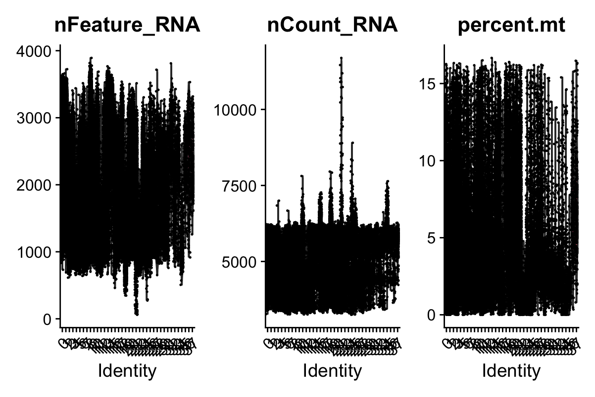

Figure-1 shows violin plots for the distribution of quality control metrics across all cells. The plot includes the number of detected genes (nFeature_RNA), total RNA counts (nCount_RNA), and percentage of mitochondrial gene expression (percent.mt). These metrics were used to filter low-quality cells prior to downstream analysis.

The QC metrics show a wide distribution of gene counts and sequencing depth across cells. Most cells fall within a moderate range of gene detection and RNA counts, but a small subset displays higher values. Mitochondrial gene expression is generally low across cells. 

Figure-2

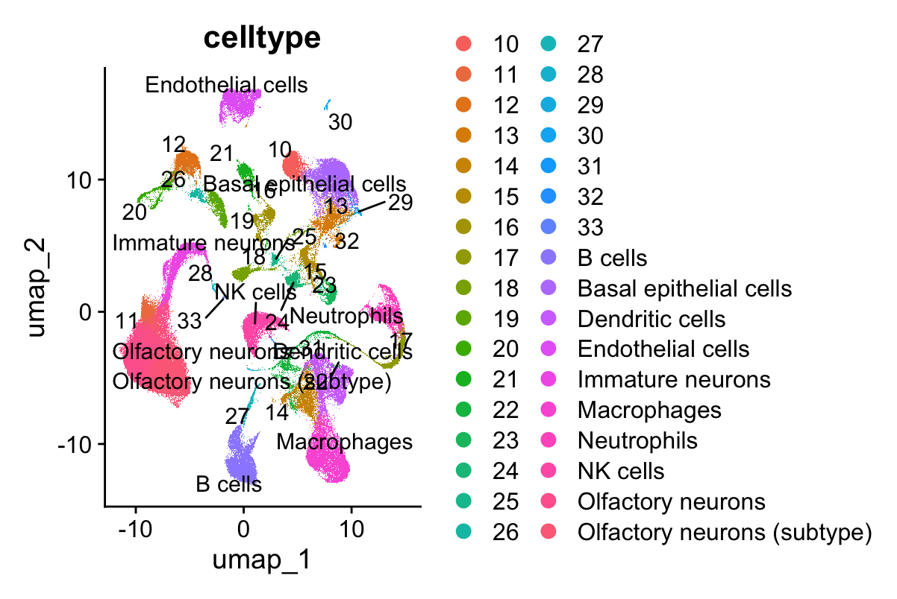

Figure-2 shows the UMAP projection of all cells colored by annotated cell types. Clusters were identified using graph-based clustering and annotated based on known marker gene expression.

The UMAP embedding reveals clear separation of major cell populations, including epithelial cells, immune cells, and neuronal cell types. Distinct clusters corresponding to macrophages, neutrophils, NK cells, and B cells are observed, along with epithelial and olfactory neuron populations. The separation suggests that clustering successfully captured biologically meaningful differences in transcriptional profiles.

FIgure-3

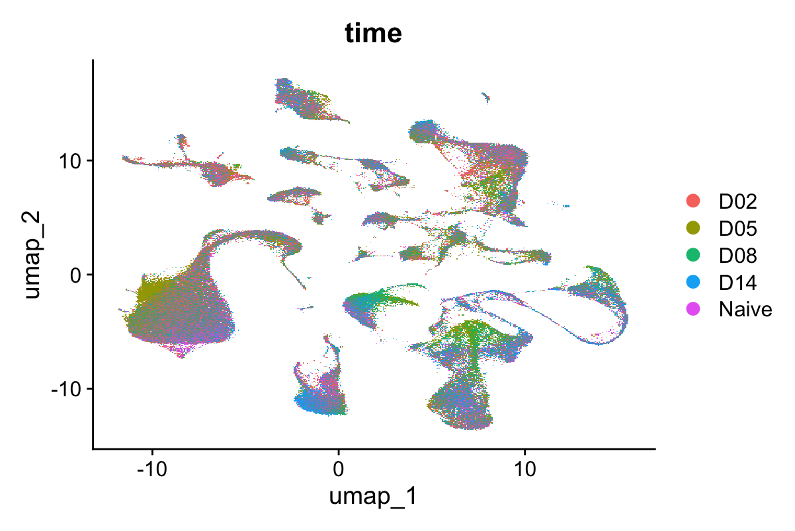

Figure-3 is the UMAP projection colored by time point (Naive, D02, D05, D08, D14), showing the distribution of cells across different stages following infection.

Cells from different time points are broadly distributed across the same clusters. Cell identity is the primary driver of clustering. However, subtle shifts in density within certain clusters suggest temporal changes in cell abundance or transcriptional states, further comparison should be applied between early and late time points.

Figure-4

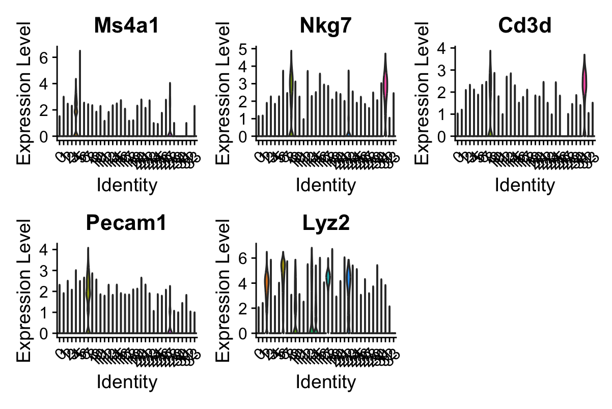
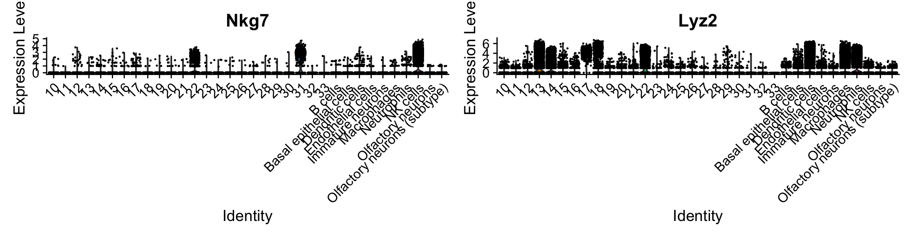
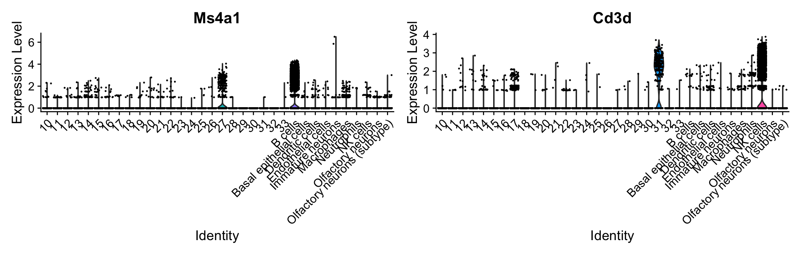
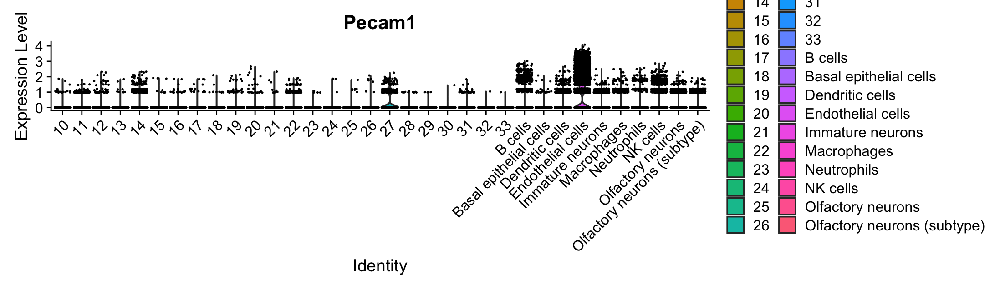

Violin plots showing expression of selected marker genes across clusters. Expression levels of Ms4a1 (B cell marker), Nkg7 and Cd3d (lymphoid), Pecam1 (endothelial), and Lyz2 (myeloid marker) are displayed across clusters. Each violin represents the distribution of normalized gene expression within a cluster, points for individual cells. Enrichment of marker genes in specific clusters. 

Figure-5

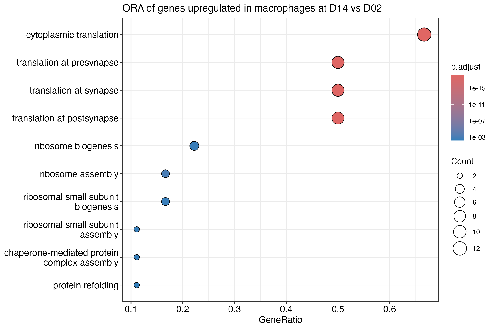

Dot plot showing Gene Ontology (GO) Biological Process enrichment for genes upregulated in macrophages at D14 compared to D02. Dot size represents gene count, and color indicates adjusted p-value.

Enrichment analysis highlights processes related to translation and ribosome biogenesis, including cytoplasmic translation and rRNA processing. These results suggest increased protein synthesis activity in macrophages at the later stage of infection. The results also reflect enhanced cellular activation or functional response.

Figure-6
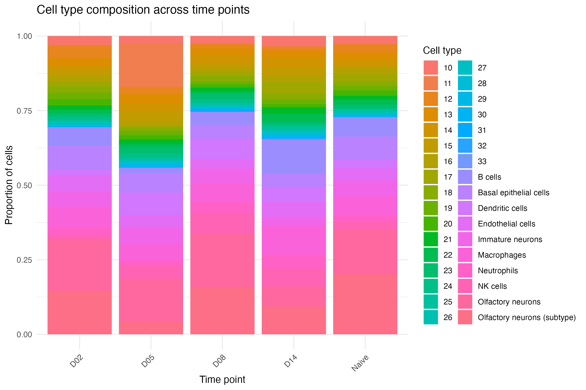

Figure-6 shows the proportion of each annotated cell type across different time points (Naive, D02, D05, D08, D14).

The relative abundance of cell types varies across time points. Immune cell populations such as macrophages, neutrophils, and NK cells show moderate changes in proportion at later stages (D08–D14) compared to earlier time points. In contrast, epithelial and neuronal populations remain stable across conditions. 

Figure-7
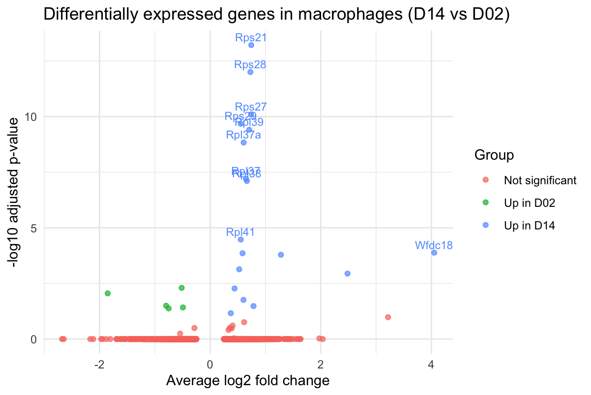

Volcano plot shows differentially expressed genes between D14 and D02 macrophages. Genes with positive log2 fold change are upregulated at D14, while negative values are upregulated at D02.

Several genes upregulated at D14 are ribosomal proteins (Rps21, Rps28, Rpl37a dominating), indicating increased expression of translation-related genes. In contrast, fewer genes are upregulated at D02, suggesting a stonger transcriptional shift at the later stage. 

## **Discussion**

This study used single-cell RNA sequencing to characterize cell populations and transcriptional changes in mouse nasal tissues following influenza A virus (IAV) infection. Clustering and marker-based annotation identified many epithelial, neuronal, and immune cell types, including macrophages, neutrophils, NK cells, and B cells. The separation of these populations in the UMAP embedding indicates that the clustering approach captured true biological variation across the dataset.

The overall UMAP structure remained stable, suggesting that cell identity is the primary source of variation. However, differences in the distribution of cells across clusters indicate that infection might alter the abundance of specific populations rather than generating entirely new cell types. This is consistent with previous studies that showed the immune responses to IAV involve dynamic transcriptional changes within existing cell populations (Iwasaki & Pillai, 2014; Krammer et al., 2018).

Differential expression analysis of macrophages revealed clear differences between early (D02) and later (D14) stages of infection. Genes upregulated at D14 were enriched for processes related to translation and ribosome biogenesis. This pattern suggests an increase in protein synthesis activity at later stages of infection. One explanation is that macrophages transition to a more active functional state, producing cytokines, signaling molecules, and some immune-related proteins required for sustained antiviral responses. Increased translational activity has been associated with immune cell activation in viral infection contexts, supporting this interpretation (Iwasaki & Pillai, 2014).

However enrichment of translation-related pathways is commonly observed in scRNA-seq datasets and may partly reflect high expression of ribosomal genes rather than a specific biological process (Luecken & Theis, 2019). As a result, the observed enrichment may not exclusively indicate functional activation but could also arise from technical or baseline transcriptional effects. Additional validation or comparison with other cell types would be required to confirm whether this signal is specific to macrophages in this context.

Several limitations of this analysis should also be pointed out. First, differential expression was performed on downsampled cells, which reduces computational burden but that mmight decrease statistical power and limit detection of subtle differences. Second, the analysis focused on a single cluster, meaning that changes in other cell types were not explored. In addition, functional enrichment analysis provides indirect inference of biological processes and thus it does not establish causal relationships. Besides, from the volcano plot, many of the significant genes are ribosomal proteins, and they are highly expressed in scRNA-seq data commonly. This may partially explain the strong enrichment of translational pathways.

Future work could extend this analysis by examining additional clusters, comparing responses across tissue types, or applying trajectory-based approaches to better capture temporal changes in cellular states. Incorporating cell to cell interaction analysis can also provide information into how different populations coordinate during infection.

Overall, this study demonstrates how scRNA-seq can be used to resolve cell type–specific responses to viral infection. The observed increase in translational related processes in macrophages at later stages indicates functional changes, although further analysis is needed to determine the biological significance of this pattern.

## **Reference**
Butler, A., Hoffman, P., Smibert, P., Papalexi, E., & Satija, R. (2018).
Integrating single-cell transcriptomic data across different conditions, technologies, and species. Nature Biotechnology, 36(5), 411–420. https://doi.org/10.1038/nbt.4096

Iwasaki, A., & Pillai, P. S. (2014).
Innate immunity to influenza virus infection. Nature Reviews Immunology, 14(5), 315–328. https://doi.org/10.1038/nri3665

Krammer, F., Smith, G. J. D., Fouchier, R. A. M., et al. (2018).
Influenza. Nature Reviews Disease Primers, 4, 3. https://doi.org/10.1038/s41572-018-0002-y

Luecken, M. D., & Theis, F. J. (2019).
Current best practices in single-cell RNA-seq analysis: A tutorial. Molecular Systems Biology, 15(6), e8746. https://doi.org/10.15252/msb.20188746

McInnes, L., Healy, J., & Melville, J. (2018).
UMAP: Uniform Manifold Approximation and Projection for dimension reduction. arXiv preprint arXiv:1802.03426. https://doi.org/10.48550/arXiv.1802.03426

Stuart, T., Butler, A., et al. (2019).
Comprehensive integration of single-cell data. Cell, 177(7), 1888–1902. https://doi.org/10.1016/j.cell.2019.05.031

Yu, G., Wang, L. G., Han, Y., & He, Q. Y. (2012).
clusterProfiler: An R package for comparing biological themes among gene clusters. OMICS: A Journal of Integrative Biology, 16(5), 284–287. https://doi.org/10.1089/omi.2011.0118

##**Additional feature plots***

Figure captions on X axis have been rotated 45-90 angle to show:

Figure-8
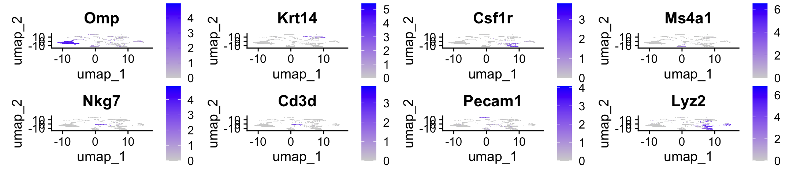

UMAP feature plots showing expression of selected marker genes across cell populations.
Expression of Omp (olfactory neurons), Krt14 (basal epithelial cells), Csf1r and Lyz2 (macrophage markers), Ms4a1 (B cells), Nkg7 and Cd3d (T cell markers), and Pecam1 (endothelial cells) is visualized on the UMAP embedding. Normalized expression levels for each gene. 

