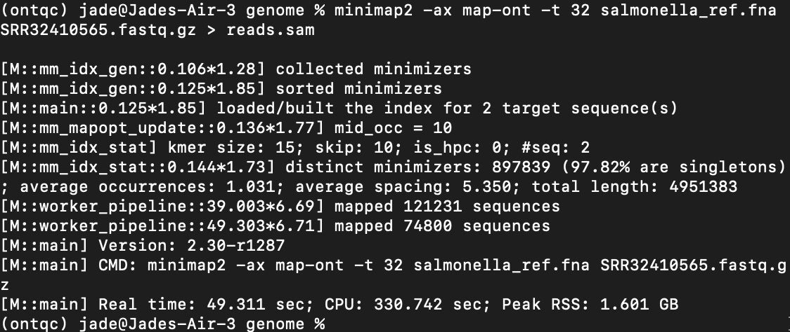
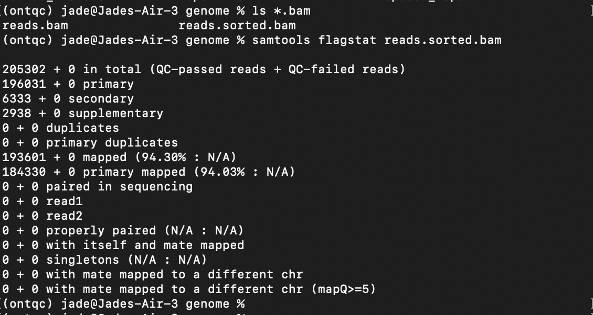
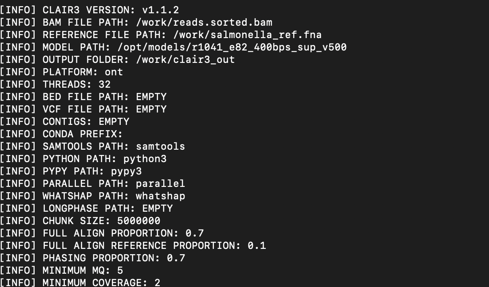
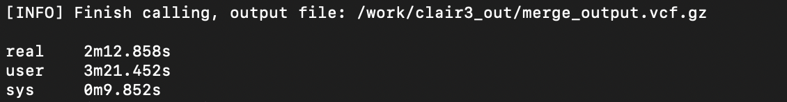
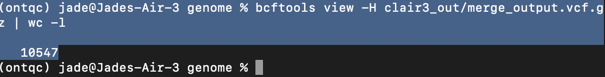

## **Introduction**

The objective of this assignment is to assemble a consensus genome of Salmonella enterica from Oxford Nanopore R10 sequencing reads, align the assembly to a reference genome obtained from NCBI, and finally, identify and visualize genomic differences. This workflow highlights both the strengths and limitations of long-read genome assembly and some genome comparison approaches.

Genome assembly is a core task in bioinformatics that aims to read and reconstruct an organism’s whole genome sequence from fragmented sequencing reads. Recent long-read sequencing technologies, such as Oxford Nanopore Technologies, improve the feasibility of de novo genome assembly for bacterial genomes (Salmonella enterica) [1]. Additionally, genome assembly remains challenging due to sequencing errors, repetitive genomic regions, costs and structural complexity.

Long-read sequencing offers a major advantage over short-read technologies by producing reads that can cover repetitive regions and complex genomic structures, resulting in better assembly contiguity [1]. However, long-read data could be more error-prone than short-read data, such as the insertion–deletion error. This affects consensus accuracy and complicates downstream analyses if not properly corrected during assembly and polishing steps [1].

Therefore, Flye assemblers have been developed to address the challenges of assembling long, error-prone reads by using repeat graphs for complex genomic structures [2]. For relatively small bacterial genomes like Salmonella enterica (5 Mb), only long-read assembly is often sufficient to produce highly contiguous assemblies, forming a single chromosomal contig. Nevertheless, assembly quality is influenced by read quality, coverage, and parameter selection, making the methodological choices essential.

In addition, the comparison to a reference genome after the assembly allows for the identification of nucleotide variants. Alignment tools optimized for long-read and reference comparisons, such as Minimap2, provide accurate genome-wide alignments [3]. Reference-based comparisons also facilitate validation of assembly accuracy and biological interpretation of observed differences. However, reliance on a reference genome may introduce bias if the sequenced strain differs substantially from the reference sequence.

## **Methods**

**Sequencing Data**

Raw sequencing reads will be provided in FASTQ format, from Oxford Nanopore Technologies with R10 chemistry. The dataset has a read accuracy of Q20+ and a read length N50 between 5 and 15 kb, which is appropriate for long-read assembly of bacterial genomes.
Quality control
Initial quality assessment of raw reads will be performed to show and evaluatethe  read length distributions and overall dataset characteristics. Although long-read assemblers such as Flye can tolerate sequencing errors, maintaining sufficient read quality is important to reduce mis-assemblies and improve consensus accuracy [1]. Therefore, extremely low-quality reads should be excluded prior to assembly.

**Genome assembly**

De novo genome assembly will be conducted using Flye (v2.9 macos), a long-read assembler designed for error-prone sequencing data [2]. Flye will be run in --nano-raw mode, which is appropriate for uncorrected Oxford Nanopore reads. The genome size parameter will be set to approximately 5 Mb, reflecting the expected size of Salmonella enterica. This genome size estimate helps guide graph construction and repeat resolution during assembly [2].

**Assembly post-processing and polishing**

Post-assembly polishing will be performed to improve the consensus sequence by correcting potential system sequencing errors. Post-processing is particularly important for Nanopore-only assemblies, because residual base-calling errors may remain after initial assembly [1]. Polishing tools trained on Nanopore data will be used to refine the final consensus sequence.

**Reference genome retrieval**

A complete reference genome for Salmonella enterica will be downloaded from the NCBI RefSeq database, which provides standardized reference sequences with associated metadata [5]. The reference genome accession number and strain information will be documented to ensure reproducibility.

**Genome alignment and comparison**

The polished assembly will be aligned to the reference genome using Minimap2 (v2.26), which is optimized for fast and accurate alignment of long sequences and genome assemblies [3]. Default parameters suitable for assembly-to-reference alignment will be used. This alignment will serve as the basis for identifying sequence differences between the assembled genome and the reference.

**Assembly quality check**

Assembly quality metrics, including total assembly length, number of contigs, and N50, will be assessed using QUAST (v5.2.0) [4]. Comparing these metrics to the expected genome size of Salmonella enterica will help evaluate assembly completeness and structural accuracy.

## **Part-2**
**Data Acquisition and Quality Assessment**

Raw long-read sequencing data for Salmonella enterica were generated using Oxford Nanopore Technologies (ONT) R10 chemistry, which is associated with improved base-calling accuracy (Q20+) and long read lengths suitable for de novo genome assembly.
Raw file quality was checked by inspecting the compressed FASTQ file. Summary was generated using SeqKit for Q, read count, total bases, and read length distribution:

head SRR32410565.fastq.gz

seqkit stats SRR32410565.fastq.gz

**Genome Assembly**

Assembly was performed using Flye. Since the dataset was generated using high-accuracy R10 chemistry and confirmed by the QC checking that Q is greater than 15, the --nano-hq parameter, along with 32 thread CPU cores, were selected to apply a lower error model during assembly (Kolmogorov et al., 2019).

flye --nano-hq SRR32410565.fastq.gz \
--genome-size 5m \
--threads 32 \
--out-dir flye_output

A genome size of approximately 5 Mb was expected based on bacterial genome characteristics.

**Assembly Quality Evaluation**

Assembly quality was assessed using QUAST, including contig number, N50, genome length, and GC content.
quast.py flye_output/assembly.fasta -o quast_results

To further evaluate structural accuracy, the assembly was compared against a reference genome downloaded from NCBI.

**Reference Genome Retrieval**

A complete reference genome for Salmonella enterica was downloaded and named reference.fastq.zip from the NCBI datasets. 

**Read Alignment**

Raw sequencing reads were aligned to the reference genome using minimap2 (suitable for long-read alignment). The Oxford Nanopore preset (map-ont) was used to account for platform-specific error profiles (Li, 2018).

minimap2 -ax map-ont -t 32 salmonella_ref.fna SRR32410565.fastq.gz 
samtools sort -o reads.sorted.bam

Figure-1: running minimap2

  

The sorted BAM file was indexed for efficient querying:
samtools index reads.sorted.bam

Besides, alignment statistics were evaluated to test mapping and species concordance:
samtools flagstat reads.sorted.bam

Figure-2: minimap2_results

  

High mapping rates indicated strong agreement between the sequenced isolate and the reference genome.

**Variant Calling**

Variants were identified using Clair3 (Zheng et al., 2022). Clair3 integrates pileup and full-alignment models to improve detection accuracy, including the indels and homopolymer regions.
The analysis was executed within a Docker container to ensure reproducibility and avoid dependency conflicts:

Figure-3: Clair3_Verision

  

docker run --rm --platform linux/amd64 \
-v "$(pwd)":/work \
hkubal/clair3 \
/opt/bin/run_clair3.sh \
--bam_fn=/work/reads.sorted.bam \
--ref_fn=/work/salmonella_ref.fna \
--threads=32 \
--platform="ont" \
--model_path="/opt/models/r1041_e82_400bps_sup_v500" \
--include_all_ctgs \
--output=/work/clair3_out

The final variant file (merge_output.vcf.gz) was indexed and used for visualization.
Variant counts were summarized using bcftools:
bcftools view -H clair3_out/merge_output.vcf.gz | wc -l

Figure-4: Clair3_end

  

A total of 10,547 variants were detected.

Figure-5:  Variant_results 

  

**IGV_Visualization**

Variants were visually validated using the Integrative Genomics Viewer (IGV). The reference genome, aligned reads, and compressed VCF file were loaded simultaneously to confirm variant positions and reads. High read depth and consistent base mismatches across multiple reads showed true biological variation, rather than sequencing artifacts.

## **Discussion**

The assembly and analysis revealed genomic differences between the sequenced raw isolate and the reference Salmonella enterica genome. A total of 10,547 variants were identified, representing approximately 0.2% divergence across the ~5 Mb bacterial genome. This degree of variation is consistent with expected diversity and might reflect the evolutionary dynamics in bacterial populations.

Horizontal gene transfer plays a major role in bacterial evolution and can introduce new genetic material through plasmids, transposons, and bacteriophages. Additionally, environmental selection favors the mutation accumulation that enables adaptation to diverse ecological niches. Therefore, the detected variants likely represent natural biological variation rather than sequencing or analytical error.

The use of long-read sequencing significantly improved assembly quality by spanning repetitive genomic regions that often fragment short-read assemblies (Kolmogorov et al., 2019); however, residual sequencing errors remain possible. As stated in the methods, the application of Clair3 improved indel detection by applying network models trained specifically on Nanopore data and reduced false-positive variant calls. 

Structural differences between the assembled genome and the reference may also arise from the presence or absence of plasmids, genome rearrangements, or lineage-specific genes. Such variation is expected when comparing distinct isolates rather than technical replicates of the same strain.

Importantly, visualization in IGV confirmed strong read support at representative variant sites, providing additional confidence in the accuracy of the variant-calling pipeline. The agreement between alignment data and variant predictions suggests that the workflow—from assembly through variant detection—was executed successfully.

Overall, the results demonstrate that long-read sequencing combined with modern bioinformatics tools enables reliable reconstruction and comparison of bacterial genomes. The detected genomic divergence highlights the genetic heterogeneity within Salmonella enterica and underscores the importance of reference-based analyses for identifying strain-level differences.

## **References**

1.	Amarasinghe SL, Su S, Dong X, Zappia L, Ritchie ME, Gouil Q. Opportunities and challenges in long-read sequencing data analysis. Genome Biology. 2020;21:30.
2.	Kolmogorov M, Yuan J, Lin Y, Pevzner PA. Assembly of long, error-prone reads using repeat graphs. Nature Biotechnology. 2019;37(5):540–546.
3.	Li H. Minimap2: pairwise alignment for nucleotide sequences. Bioinformatics. 2018;34(18):3094–3100.
4.	Gurevich A, Saveliev V, Vyahhi N, Tesler G. QUAST: quality assessment tool for genome assemblies. Bioinformatics. 2013;29(8):1072–1075.
5.	O’Leary NA, Wright MW, Brister JR, et al. Reference sequence (RefSeq) database at NCBI: current status. Nucleic Acids Research. 2016;44(D1):D733–D745.
6.	Kolmogorov, M., Yuan, J., Lin, Y., & Pevzner, P. A. (2019). Assembly of long, error-prone reads using repeat graphs. Nature Biotechnology, 37(5), 540–546.. https://doi.org/10.1038/s41587-019-0072-8
7.	Li, H. (2018). Minimap2: Pairwise alignment for nucleotide sequences. Bioinformatics, 34(18), 3094–3100. https://doi.org/10.1093/bioinformatics/bty191
8.	Zheng, Z., Li, S., Su, J., et al. (2022). Symphonizing pileup and full-alignment for deep learning-based long-read variant calling. Nature Computational Science, 2, 797–803. https://doi.org/10.1038/s43588-022-00387-x

