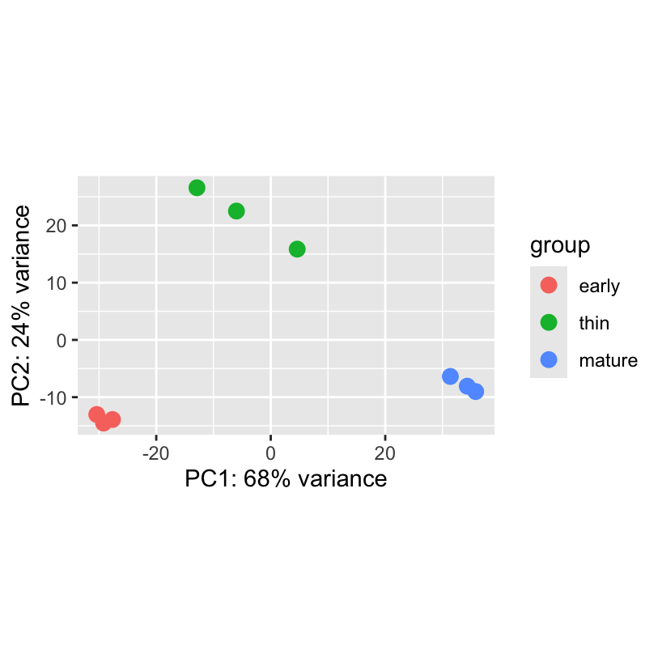
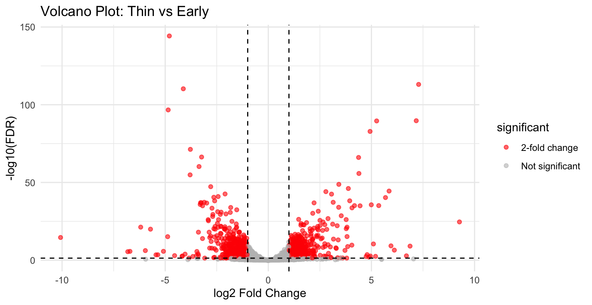
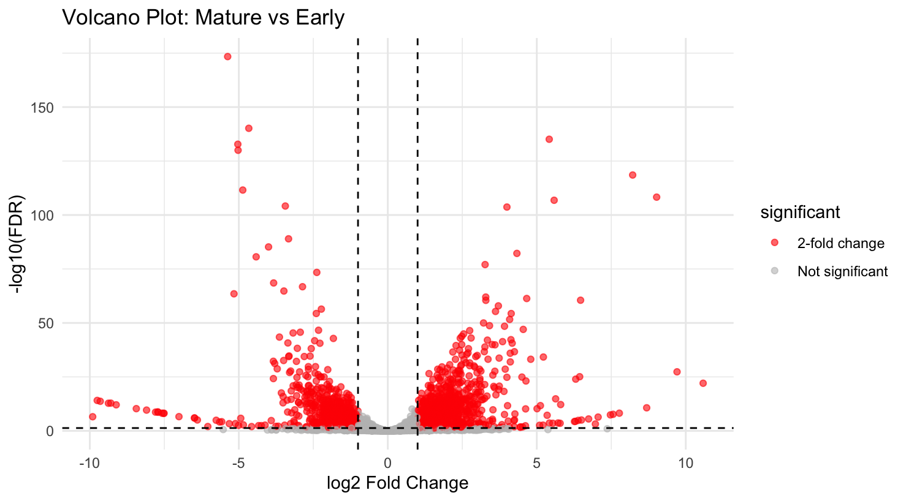
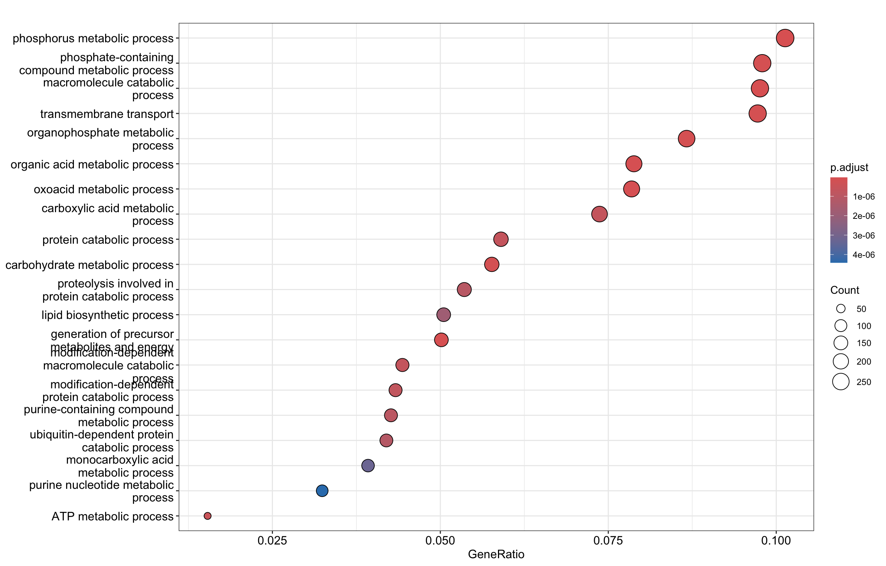
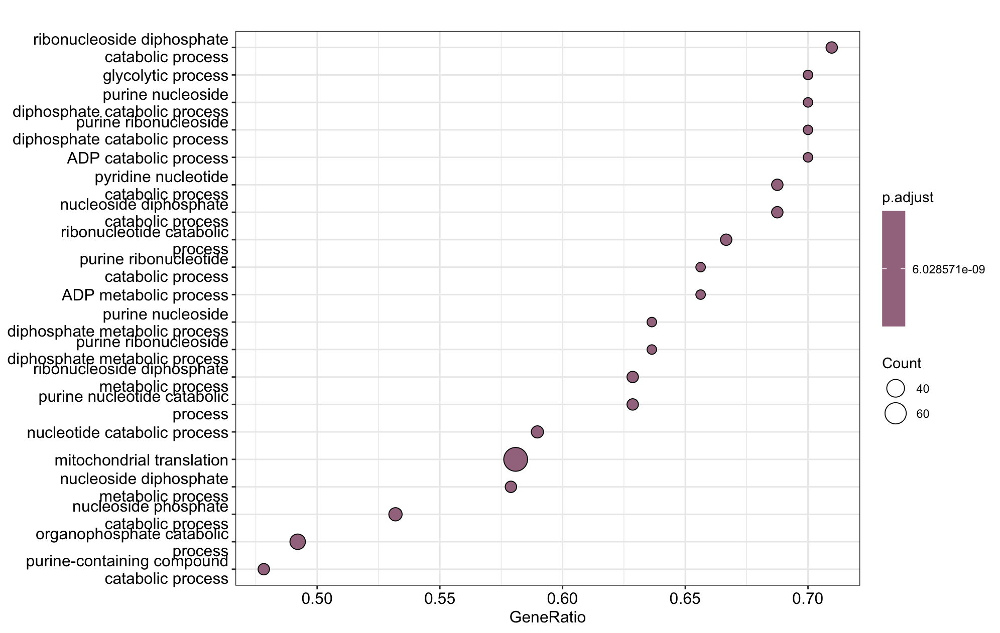

## **Differential Gene Expression Analysis of Yeast Velum Development During Wine Aging**

## **Introduction**
Flor yeasts are specialized strains of Saccharomyces cerevisiae that form a floating biofilm (velum) during biological wine aging. Velum formation allows yeast cells to survive in nutrient-limited and oxidative conditions by switching from fermentative to oxidative metabolism. This transition involves many transcriptional reprogrammings, which would affect metabolic pathways, stress responses, and cellular remodeling.

The dataset used in this study originates from a transcriptomic analysis of velum development across three biological stages: early, thin, and mature, each with three biological replicates. Understanding transcriptional changes across these stages provides insight into the molecular mechanisms driving biofilm maturation and metabolic adaptation.

The following steps were applied when analyzing data: 

DESeq2 for differential gene expression

Variance stabilizing transformation (VST) for visualization

GO enrichment (ORA) using clusterProfiler

Gene Set Enrichment Analysis (GSEA) to capture coordinated pathway shifts

## **Methods**
**Data Import and Preprocessing**

Transcript-level quantifications generated by Salmon were imported using the tximport package (Soneson et al., 2015) to generate a DESeqDataSet with three experimental groups: early, thin and mature. 

**Differential Expression Analysis**

Differential expression was performed using DESeq2 (Love et al., 2014). This analysis counted data using a negative binomial generalized linear model. Three contrasts were computed:

Thin vs Early

Mature vs Early

Mature vs Thin

and the Significance thresholds:

Adjusted p-value (FDR) < 0.05 (Benjamini–Hochberg correction)

|log2 Fold Change| > 1 (2-fold change)

**Data Visualization**

Variance stabilizing transformation (VST) was applied for the following analysis: 

PCA plot (plotPCA)

Sample distance heatmap (pheatmap)

Volcano plots

**Functional Enrichment Analysis**

Significantly differentially expressed genes (padj < 0.05) were used for:

Over-Representation Analysis (ORA) and Gene Set Enrichment Analysis (GSEA), in which genes were ranked by Wald statistic, and both analyses used Benjamini–Hochberg correction.

## **Results**
**Global Expression Patterns**

Figure 1. Principal Component Analysis (PCA) of variance-stabilized gene expression values.
PCA plot showing clustering of early, thin, and mature velum samples. PC1 explains 68% of the variance and PC2 explains 24%. Biological replicates cluster tightly within stages, indicating strong reproducibility and stage-specific transcriptomic profiles.

Principal Component Analysis (PCA) revealed strong stage-specific clustering of samples (Figure 1). PC1 accounted for 68% of total variance, while PC2 explained 24%, together explaining 92% of the overall transcriptional variability. Early, thin, and mature samples formed clearly separated clusters, indicating substantial transcriptional reprogramming across velum development. Replicates clustered tightly within each stage, demonstrating high biological reproducibility and minimal technical variation.

Figure 2. Sample distance heatmap of variance-stabilized expression values.
Heatmap representing Euclidean distances between samples. Samples cluster primarily by developmental stage, confirming distinct transcriptional identities and minimal intra-group variability.

The sample-to-sample distance heatmap further confirmed this separation (Figure 2). Samples from the same developmental stage showed high similarity, while inter-stage comparisons exhibited larger distances. Notably, mature samples displayed the greatest divergence from early-stage samples, suggesting progressive transcriptional remodeling during biofilm maturation.

These global analyses demonstrate that velum development is accompanied by coordinated, large-scale shifts in gene expression.

**Differential Gene Expression Across Developmental Stages**

Figure 3. Volcano plot of differential expression: Thin vs Early.
Each point represents a gene. Red points indicate genes with |log2FoldChange| > 1 and adjusted p-value < 0.05. Dashed lines represent the significance thresholds. The thin stage exhibits substantial bidirectional gene regulation relative to early stage.

**Thin vs Early**

The Thin vs Early comparison revealed numerous significantly differentially expressed genes (FDR < 0.05), with many exceeding a two-fold change threshold (|log2FC| > 1) (Figure 3). Both upregulated and downregulated genes were observed, indicating that the thin stage represents an active transitional phase rather than a unidirectional shift in gene expression. This transitional profile suggests metabolic rewiring as yeast cells begin adapting from fermentative growth toward a more oxidative, biofilm-associated lifestyle.

Figure 4. Volcano plot of differential expression: Mature vs Early.
Significant genes (red) meet the criteria of |log2FoldChange| > 1 and adjusted p-value < 0.05. Mature velum shows widespread transcriptional reprogramming compared to early stage, reflecting advanced biofilm maturation.

**Mature vs Early**

The Mature vs Early comparison exhibited even broader transcriptional divergence (Figure 4). A large number of genes showed strong log2 fold changes and highly significant adjusted p-values, indicating substantial remodeling between early and mature biofilm stages. The magnitude and density of significant genes in this contrast suggest that mature velum cells undergo profound metabolic and structural reprogramming relative to early-stage cells.

**Functional Enrichment Analysis**

Figure 5. GO Biological Process enrichment (ORA) for Mature vs Early.
Dotplot showing significantly enriched GO terms (Biological Process ontology). Dot size corresponds to gene ratio, and color indicates adjusted p-value. Enriched terms highlight metabolic remodeling and energy-associated pathways during velum maturation.

GO Biological Process enrichment identified significant overrepresentation of pathways including:

Phosphorus metabolic process

Phosphate-containing compound metabolism

Carbohydrate metabolic process

Organic and oxoacid metabolism

Lipid biosynthetic process

Transmembrane transport

ATP metabolic process

Protein catabolic process

Ubiquitin-dependent protein catabolism

These enriched processes indicate:

Increased metabolic flux

Elevated energy demand

Active macromolecular turnover

Proteome remodeling

The strong enrichment of ATP and phosphate metabolism suggests heightened energy production and utilization in mature velum. Meanwhile, enrichment of ubiquitin-dependent protein catabolism indicates active restructuring of the proteome during adaptation to oxidative stress.

Figure 6. Gene Set Enrichment Analysis (GSEA) results for Mature vs Early.
Dotplot and enrichment curve showing significantly enriched Biological Process pathways. Enrichment of mitochondrial translation and nucleotide metabolism supports enhanced oxidative metabolism in mature velum.

GSEA identified coordinated enrichment of entire biological pathways across the ranked gene list, including:

Glycolytic process

Purine nucleotide metabolic process

ADP metabolic process

Organophosphate catabolic process

Nucleotide catabolic process

Mitochondrial translation

The enrichment of mitochondrial translation strongly suggests increased synthesis of mitochondrial proteins and enhanced respiratory activity. This finding supports a metabolic transition from fermentation toward oxidative phosphorylation in mature velum.

Enrichment of nucleotide and ADP metabolic processes further indicates elevated ATP turnover and energetic cycling.

Together, ORA and GSEA analyses converge on a consistent biological narrative: velum maturation is associated with systemic metabolic reprogramming and increased respiratory metabolism.

## **Discussion**

This study demonstrates that yeast velum maturation is accompanied by extensive transcriptional remodeling and metabolic reorganization.

The strong stage separation observed in PCA confirms distinct transcriptomic identities for early, thin, and mature stages. Differential expression analysis revealed progressively larger transcriptional divergence as the biofilm matured.

Functional enrichment results indicate that mature velum cells:

Enhance mitochondrial function

Increase ATP production and turnover

Activate nucleotide metabolic pathways

Remodel the proteome through ubiquitin-mediated degradation

Adjust transport systems to optimize metabolite exchange

The enrichment of mitochondrial translation provides compelling evidence for increased respiratory activity. Flor yeasts are known to rely on oxidative metabolism during biological wine aging, where oxygen exposure at the liquid surface promotes respiration over fermentation. Our results align with this established biological framework.

Upregulation of protein catabolic and macromolecule turnover pathways likely reflects cellular adaptation to oxidative stress and nutrient limitation. Such restructuring may enable long-term survival under the harsh environmental conditions encountered during wine aging.

Collectively, these findings support a model in which velum maturation represents a coordinated shift toward oxidative metabolism, enhanced energy production, and structural adaptation necessary for biofilm persistence.

